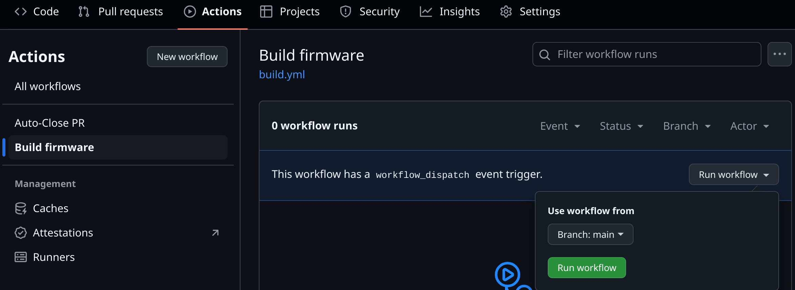
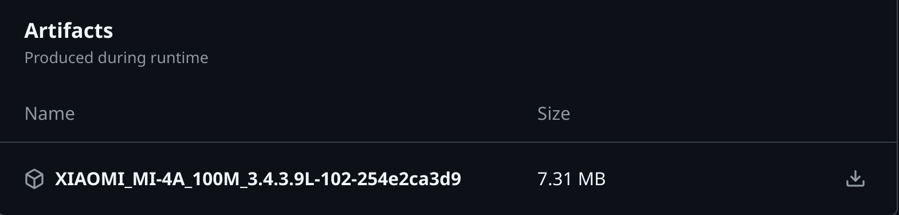
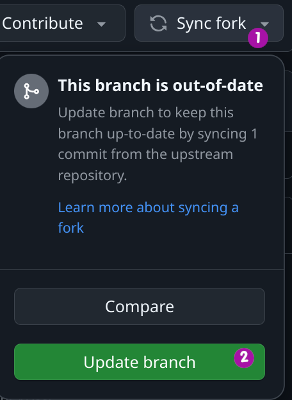
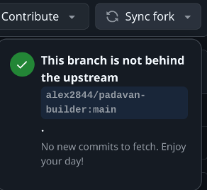

## Сборка прошивки Padavan с помощью Github Actions

### Использование

1. **Создайте копию (форк) этого репозитория:**

    
  
2.  **(Необязательно) Настройте переменные сборки:**
    * В своем форке откройте файл [`variables`](../../variables) в корне репозитория.
    * Измените переменные в соответствии с вашими требованиями:
      *  **`PADAVAN_REPO`**: Ссылка на репозиторий Padavan (по умолчанию: `https://gitlab.com/hadzhioglu/padavan-ng.git`).
      *  **`PADAVAN_BRANCH`**: Ветка репозитория (по умолчанию: `master`).
      *  **`PADAVAN_COMMIT`**: Коммит для сборки (по умолчанию: `HEAD`).
      *  **`PADAVAN_TOOLCHAIN_URL`**: Ссылка на файл toolchain (по умолчанию: `https://gitlab.com/api/v4/projects/hadzhioglu%2Fpadavan-ng/packages/generic/toolchain/latest/toolchain.tzst`).
      *  **`PADAVAN_CONFIG`**:  
          *   **Путь к файлу конфигурации (`.config`)**  в вашем репозитории, 
          *   **или URL-адрес файла конфигурации**, 
          *   **или оставьте пустым**, чтобы использовать `build.config`.
      *  **`PADAVAN_THEMES_REPO`**: Ссылка на репозиторий с темами (по умолчанию: `https://gitlab.com/hadzhioglu/padavan-themes.git`).
      *  **`PADAVAN_THEMES_BRANCH`**: Ветка репозитория с темами (по умолчанию: `main`).
      *  **`PADAVAN_THEMES`**: Список тем через пробел (например, `blue yellow`). 

3.  **(Необязательно) Настройте параметры сборки:**
    * Откройте файл [`build.config`](../../build.config) в корне репозитория и измените его в соответствии с вашими требованиями. 
    * Этот шаг необязателен, если вы указали путь к другому файлу конфигурации в переменной `PADAVAN_CONFIG`.
    * Шаблон конфига для вашего устройства можно взять в [репозитории прошивки](https://gitlab.com/hadzhioglu/padavan-ng/-/tree/master/trunk/configs/templates)

4.  **(Необязательно)  Добавьте свои скрипты:**
    * Создайте файл `pre-build.sh` в корне репозитория для выполнения команд перед сборкой прошивки.
    * Создайте файл `post-build.sh` в корне репозитория для выполнения команд после сборки прошивки.

5. **Запустите сборку:**  
   * Перейдите в раздел **Actions** вашего форка на Github.
   * Выберите workflow **`Build firmware`**.
   * Нажмите **"Run workflow"**, выберите ветку и подтвердите запуск, нажав на кнопку **"Run workflow"**:

     

6. **Скачайте прошивку:**  
   *  После успешной сборки (обычно занимает от 15 минут до часа) перейдите на вкладку **"Summary"** на странице запуска workflow.
   *  В разделе **Artifacts** нажмите на кнопку скачивания рядом с названием вашего архива:

     

### Обновление форка

Периодически в этот репозиторий могут вноситься обновления. Чтобы получить эти обновления в своем форке, выполните следующие действия:

1. Откройте страницу вашего форка на Github.
2. Вы увидите уведомление о том, что ваш форк отстает от оригинального репозитория, **если обновления доступны**. 
3. Нажмите на кнопку **"Sync fork"**, а затем на **"Update branch"**:

    

4.  Дождитесь завершения синхронизации. 

**Если ваш форк уже обновлен, вы увидите следующее уведомление:** 

### Дополнительная информация

* Workflow использует образ Docker `registry.gitlab.com/hadzhioglu/padavan-ng` для сборки. 
* Лицензия прошивки Padavan не подразумевает распространения готовых сборок. Собранные прошивки предназначены только для личного пользования. Архив с вашей прошивкой будет храниться в Github Actions в течение 7 дней. 
