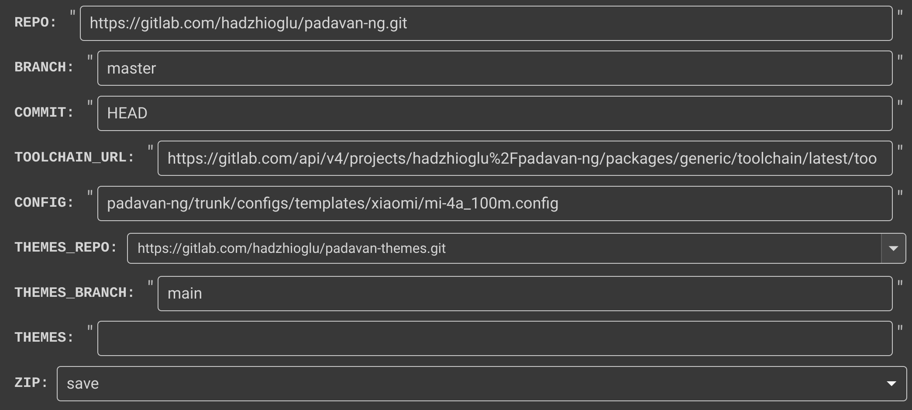
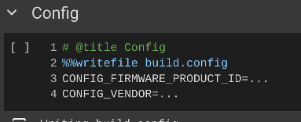
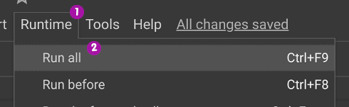

## Сборка прошивки Padavan с помощью Google Colab

### Использование

1. **Откройте блокнот в Google Colab:**

    

2. **Авторизуйтесь** в Google Colab.

3. **Задайте переменные в разделе "Variables":**
    * **REPO:** Ссылка на репозиторий Padavan (по умолчанию: `https://gitlab.com/hadzhioglu/padavan-ng.git`).
    * **BRANCH:** Ветка репозитория (по умолчанию: `master`).
    * **COMMIT:** Коммит для сборки (по умолчанию: `HEAD`).
    * **TOOLCHAIN_URL:** Ссылка на файл toolchain (по умолчанию: `https://gitlab.com/api/v4/projects/hadzhioglu%2Fpadavan-ng/packages/generic/toolchain/latest/toolchain.tzst`).
    * **CONFIG:**
        * Укажите **путь к файлу конфигурации (` .config`)** на вашем Google Drive, URL-адрес файла,
        * **или используйте путь из репозитория Padavan** (например, `padavan-ng/trunk/configs/templates/xiaomi/mi-4a_100m.config`),
        * **или оставьте пустым**, чтобы использовать `build.config` (настраивается в разделе "Config").
    * **THEMES_REPO:** Ссылка на репозиторий с темами (по умолчанию: `https://gitlab.com/hadzhioglu/padavan-themes.git`).
    * **THEMES_BRANCH:** Ветка репозитория с темами (по умолчанию: `main`).
    * **THEMES:** Список тем через запятую (например, `blue,yellow`).
    * **ZIP:**
        * `download`: Скачать архив с прошивкой после сборки.
        * `save`: Сохранить архив с прошивкой на Google Drive.

    

4. **(Необязательно) Настройка параметров сборки:**
    * Этот раздел используется для настройки параметров сборки, **если в переменной `CONFIG` не указан другой файл конфигурации**. Вы можете изменить файл `build.config` в соответствии с вашими требованиями.
    * Шаблон конфига для вашего устройства можно взять в [репозитории прошивки](https://gitlab.com/hadzhioglu/padavan-ng/-/tree/master/trunk/configs/templates)

    

5. **Запустите все ячейки кода:** Нажмите `Runtime` -> `Run all`.

    

6. **Дождитесь окончания сборки:** Процесс сборки займет некоторое время (30-60 минут). Вы можете наблюдать за прогрессом в выводе ячеек кода.

7. **Скачайте прошивку:**
    * Если вы выбрали `ZIP = 'download'`, архив с прошивкой будет загружен автоматически.
    * Если вы выбрали `ZIP = 'save'`, архив с прошивкой будет сохранен в папку `MyDrive` на вашем Google Drive.

### Описание разделов

* **Variables:** Задание переменных для настройки сборки.
* **Config:** Настройка параметров сборки.
* **Dependencies:** Установка необходимых зависимостей.
* **Download sources and toolchain:** Загрузка исходного кода Padavan и toolchain.
* **Get config:** Получение файла конфигурации.
* **Build firmware:** Сборка прошивки.
* **Prepare zip:** Подготовка архива с прошивкой.
* **Create zip:** Создание архива с прошивкой.
* **Check firmware size:** Проверка размера прошивки.
* **Download:** Скачивание архива с прошивкой.

